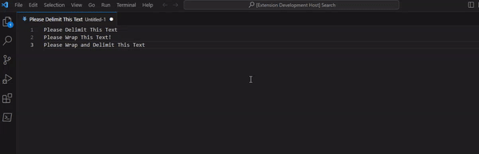

# vs-delimiter - A simple delimiter and wrapper for Visual Studio Code

## Features
Easily delimit or wrap text.
Useful for assembling SQL queries from a given string of texts

Completely customizable delimiter and wrap characters

Now available on the marketplace 
https://marketplace.visualstudio.com/items?itemName=morber11.vs-delimiter

## Requirements

Visual Studio Code

## Extension Settings

This extension contributes the following settings:

* `vs-delimiter.delimiter`: Specifies the default Delimiter to use. Defaults to a comma ,
* `vs-delimiter.wrapper`: Specifies the default Wrapper to use. Defaults to an apostrophe '

## Known Issues

- Does not currently support wrapping and delimiting on multiple lines

## Release Notes
### 1.0.0

Initial release of vs delimiter

### 1.0.1
Added an escape character for both wrapping and delimiting

Removed trailing delimiter at the end of strings
